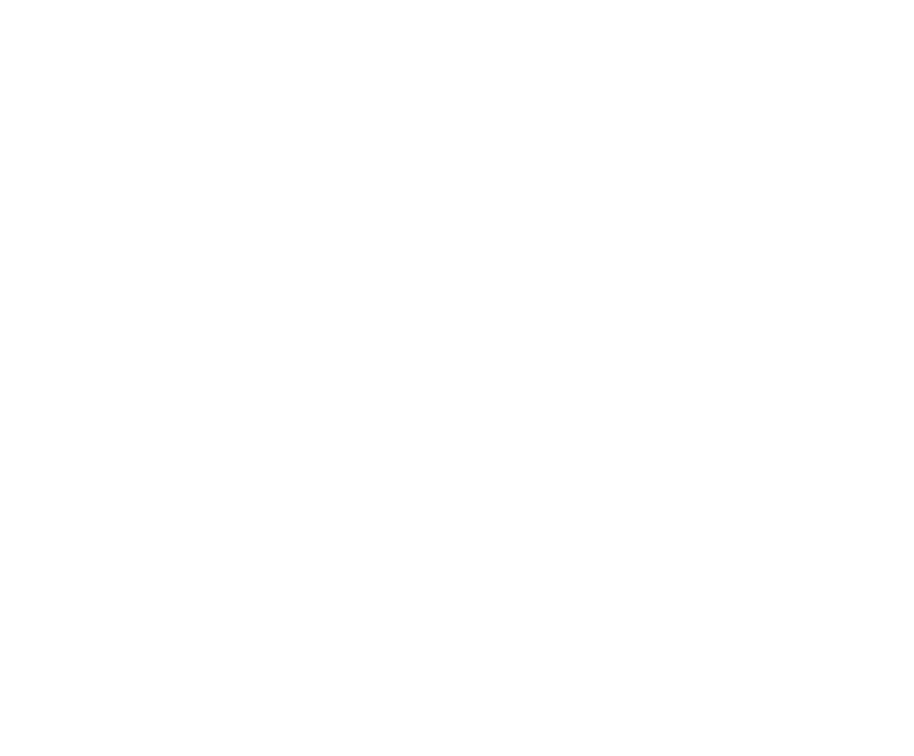
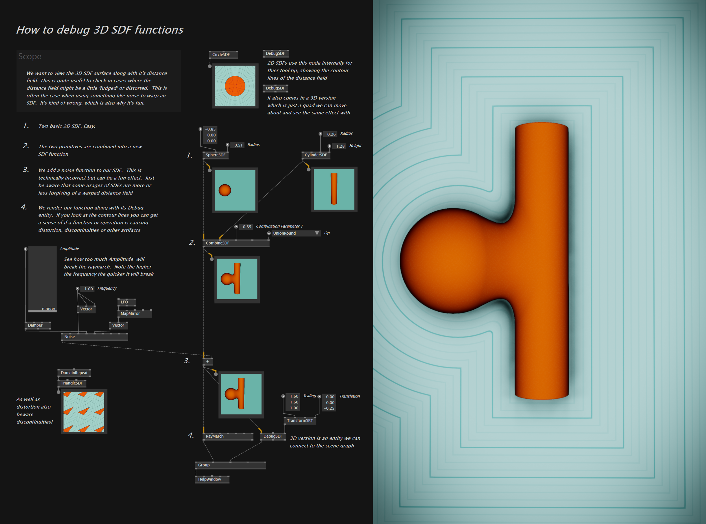

# SDSL: Stop Duplicating Shader Logic

**You only write what's different.** Everything else comes from base shaders.

SDSL (Stride Shading Language) adds object-oriented features to HLSL. Inherit matrices, streams, and rendering setups from base classes. The Stride engine has hundreds of production-tested shaders you can extend with a few lines of code.

```hlsl
shader TexturedQuad : ShaderBase, PositionStream4, Transformation, Texturing
{
    Texture2D DiffuseTexture;

    override stage void VSMain()
    {
        streams.ShadingPosition = mul(streams.Position, WorldViewProjection);
    }

    override stage void PSMain()
    {
        streams.ColorTarget = DiffuseTexture.Sample(Sampler, streams.TexCoord);
    }
};
```

Position from `PositionStream4`. Matrices from `Transformation`. UVs and sampler from `Texturing`. No boilerplate.

---

## Topics

- The shader permutation problem and how SDSL solves it
- Streams, inheritance, composition
- Draw shaders, compute shaders, material extensions
- Multi-shader systems, particles, pipelines
- Stride and vvvv workflows

**[Get Started](manual/00-setup/tools.md)**

---

## Origins

SDSL implements ideas from:

> **[Spark: Modular, Composable Shaders for Graphics Hardware](https://graphics.stanford.edu/papers/spark/spark_preprint.pdf)**
> Tim Foley & Pat Hanrahan, SIGGRAPH 2011

**Virgile Bello** ([xen2](https://github.com/xen2)) leads Stride development. Previously: Silicon Studio Tokyo (Lead Architect), NVIDIA (OpenGL team).

**Alexandre Mutel** ([xoofx](https://github.com/xoofx)) created SharpDX and designed Unity's Burst compiler. Microsoft MVP.

Built at Silicon Studio in Tokyo (2011-2016), now part of [Stride](https://stride3d.net/) (MIT license, .NET Foundation).

[New SDSL Compiler](https://github.com/stride3d/SDSL) - Pure C#, targets SPIR-V directly.

---

## In Production

<a href="https://stride3d.net/"></a>

[Stride](https://stride3d.net/) is a production game engine using SDSL for all shaders. Games, simulations, and interactive applications ship with SDSL shaders.

<a href="https://vvvv.org/"></a>

[vvvv gamma](https://vvvv.org/) uses Stride's rendering and SDSL through deep integration, adding its own base shaders (`VS_PS_Base`, `FilterBase`) and the TextureFX/DrawFX/ComputeFX/ShaderFX node system. vvvv has powered large-scale media installations since 2002: the Guggenheim Bilbao, immersive exhibitions, multi-machine live events. Used by designers, researchers, and graphics programmers who need rapid prototyping with production-quality output.

<a href="https://www.thefuselab.io/"></a>

[VL.Fuse](https://www.thefuselab.io/) overlays a powerful library with dozens of advanced rendering techniques (SDF, 3D fluid simulation, compute utilities) and an even more fine-grained shader node graph.



The hybrid workflow lets you mix SDSL text shaders, visual shader graphs, visual programming nodes, and C# code in the same project, all hot-reloading as you work.

---

## Resources

- [Stride Shader Documentation](https://doc.stride3d.net/latest/en/manual/graphics/effects-and-shaders/shading-language/)
- [Shader Explorer](https://github.com/tebjan/Stride.ShaderExplorer) - Browse Stride's shader hierarchy
- [vvvv Gray Book](https://thegraybook.vvvv.org/reference/libraries/3d/shaders.html)
